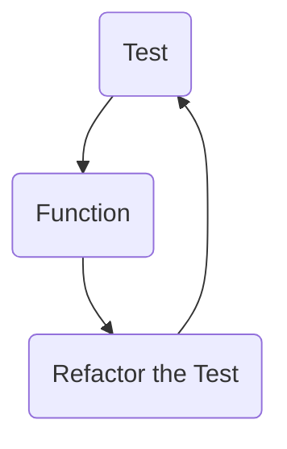

Put your plan, story, and any supporting material here, you could use the help of a readme markdown generator such as [readme.so](https://readme.so/)

# Timothy's Kata
A kata created by Timothy for the enjoyment and puzzlement of his fellow bootcampers.

## Story 
You are sat with two frogs on a log, Chris and Tom. They are arguing about who ate the most flies (Poor flies, but what you going to do!). Chris says "I ate the summation of n number of flies!". Tom replies "Well I ate five less than you plus 10"!
Cat then hops onto the log looking pleased with herself "Well, I ate the same number of flies as both yours combined."'

## Initial Planning Stage

- What style of Kata am I looking to produce?

- Maths, Logic or Word Games to name a few. There are many more types but these are the main ones I am considering right off the bat.

- When I have decided on a style of problem what level do I want to aim for?

- Is it going to be really hard but just one or will it be split into varying difficulties? What level of problem can I myself write within my skill set.

- Will I wright my own problem completely from scratch or will I take a famous Logic problem and put my own spin on it - so it can be solved programmatically.

## Answers

#### Style of Kata

I'm leaning towards a mathematical problem.
I have to be careful that focus creep doesn't become a thing. The maths problem has to fit within the timescale but be hard enough to be enjoyable and challenging.

#### Level I am aiming for

It would be best to aim for a harder kata that is more challenging than different levels of kata. This way I can focus down on planning and testing the one 
really well thought out kata. This again will help in limiting focus creep.

## Narrowing it down -

- Maths Problem

- One challenging but enjoyable Kata 

- Once the initial stage is done - I just have to
focus on writing the tests and the coding will fall into place.

## Final Thoughts
My final thoughts on what decision has been made for the problem I am going to create for my classmates. This has been a difficult thought process - as planning and working out Katas on code wars is one thing. But actually writing one myself is something else. I do think I have it narrowed down to a workable size - a maths problem that is challenging but enjoyable. I plan to work with summation of digits - as this can be done in multiple different ways - one of those being one line of code. This would make it challenging for the solver and would be interesting to see how many answers can be thought up. 

    All these said I think this is going to be a really fun
    challenge! I look forward to having my fellow bootcampers
    solve my Kata.
 